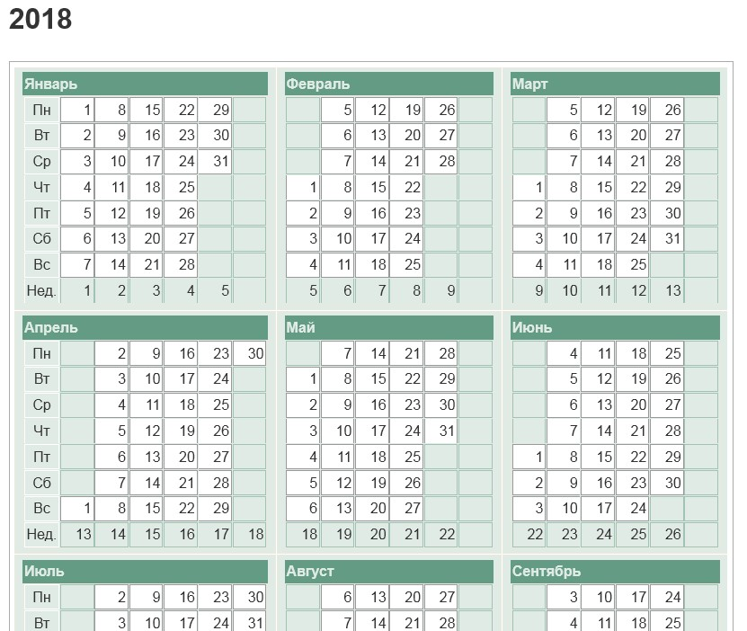
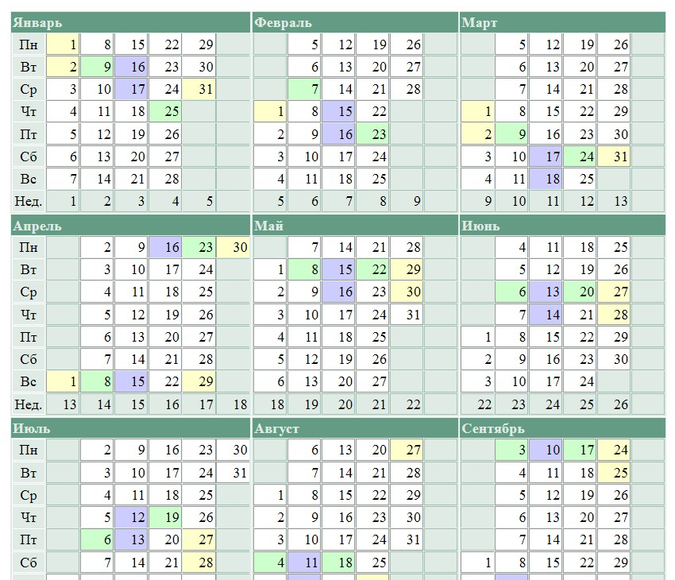

# Buddhist Lunar calendar

Suppose we have an empty calendar template (html) for a certain year:

year.html

We want to make a calendar colored with Lunar phases (Buddhist Uposatha days).

Buddhist Uposatha days traditionally are 6 days in every Lunar month:

  * 2 days of New Moon,
  * 2 days of Full Moon,
  * Two quarters, 1 day each.

So we take a text file which lists moon phases for that year.

dates.txt

The program reads both files and creates a calendar filled with colors.

Input files:

  * year.html - calendar template for the year
  * dates.txt - data on moon phases

Output: calendar for the year with moon phases.

Program files:

  * index.php - original version, with step-by-step comments for easy modification
  * index1.php - optimized version, less comprehendable

*For different data format you would need to change patterns for search & replace, and maybe something else!*

For info:

  * https://regexr.com/ - learn & train in regex patterns
  * http://www.datemoz.com/ - build calendar templates here
  * https://www.life-moon.pp.ru/phase/year/2018/ - the list of moon phases I took here

Let all sentient beings be truly happy, free from suffering and causess of suffering!
